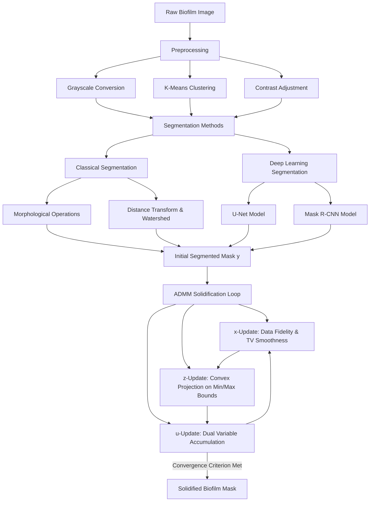
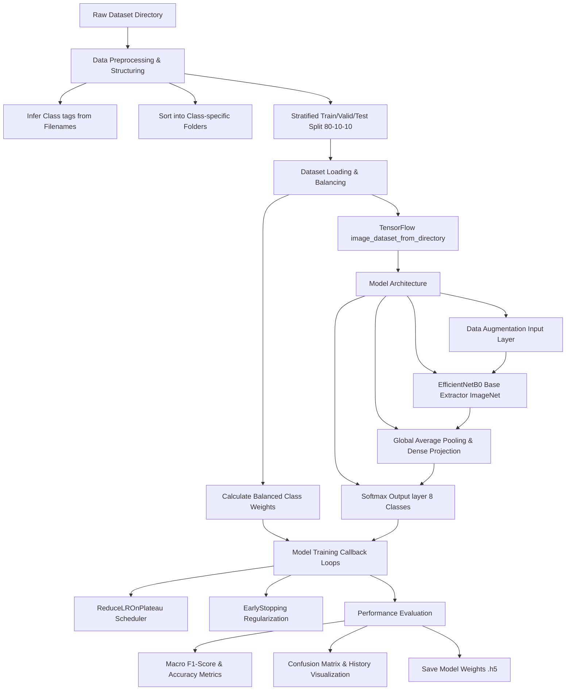

# Biofilm Image Analysis: Segmentation using ADMM & Deep Learning Classifier

[](https://opensource.org/licenses/MIT)
[](https://www.python.org/downloads/release/python-3110/)
[](https://tensorflow.org)
[](https://pytorch.org)

This repository contains a comprehensive pipeline for the **segmentation, preprocessing, solidification, and classification of biofilm images**. By combining classical mathematical optimization techniques like the **Alternating Direction Method of Multipliers (ADMM)** with state-of-the-art Deep Learning models (EfficientNetB0, U-Net, Mask R-CNN), this project provides a robust workflow for analyzing biofilm datasets.

Included in this repository is the `biofilm_effecientnet_model_dataset.zip` archive, which bundles the primary dataset, pre-trained model weights, and the core classification model code needed to reproduce our results.

---

## 🚀 Key Features

### 1. Biofilm Segmentation & Solidification
* **Classical Preprocessing**: Color space conversions, contrast adjustments, and KMeans clustering.
* **Classical Segmentation**: Morphological reconstructions, distance transforms, and Watershed segmentation.
* **Deep Learning Segmentation**: Leverages PyTorch-based **U-Net** (via `segmentation_models_pytorch`) and **Mask R-CNN** for high-precision instance segmentation.
* **ADMM-based Post-Processing**: Applies Alternating Direction Method of Multipliers (ADMM) algorithms for biofilm solidification, enforcing structural and spatial continuity constraints.



### 2. Multi-Class Biofilm Classification
* **Packaged Assets**: Ready-to-use dataset, EfficientNet weights, and model code provided in the included zip archive.
* **Directory Structuring**: Automates sorting of flat validation/test sets into structured folder formats based on inferred class tags from filenames.
* **Imbalance Handling**: Calculates class-weight metrics dynamically to handle class imbalance across 8 categories.
* **Transfer Learning & Data Augmentation**: Utilizes **EfficientNetB0** (pre-trained on ImageNet) combined with rotational, zoom, and contrast-based augmentation layers.
* **Performance Analysis**: Computes classification reports, Macro F1-scores, and generates interactive training histories and confusion matrices.



---

## 📊 Mathematical Formulation of ADMM Solidification

To segment and solidify the biofilm structures, we formulate a multi-objective optimization problem that balances data fidelity, spatial smoothness, and area/volume constraints. Let $x$ represent the primal segmentation mask, $z$ represent the auxiliary constraint variable, and $u$ be the scaled dual variable.

### 1. Objective Function
We minimize the following objective:
$$\min_{x, z} \| x - y \|_2^2 + \mu \mathrm{TV}(x) + \lambda \sum_i x_i + \gamma \sum_i (x_i - 2(I_i - I_{\text{thresh}}))^2 + \mathbb{I}_{\mathcal{C}}(z)$$

subject to $x = z$, where:
- $y$ is the reference mask.
- $I$ is the intensity image, and $I_{\text{thresh}}$ is the intensity threshold.
- $\lambda$ is the area penalty parameter.
- $\mathrm{TV}(x)$ is the anisotropic Total Variation penalty for spatial smoothness.
- $\mathbb{I}_{\mathcal{C}}(z)$ is the indicator function enforcing area bounds:
$$\mathcal{C} = \left\lbrace z \mid \text{min area} \le \sum_i z_i \le \text{max area}, \;\; 0 \le z_i \le 1 \right\rbrace$$

### 2. ADMM Iterations
The optimization problem is solved iteratively using the Alternating Direction Method of Multipliers:

#### A. Primal $x$-Update
Minimize the augmented Lagrangian with respect to $x$:

$$x^{k+1} = \text{clip}\left( \frac{2y + \rho(z^k - u^k) - \lambda - \mu \nabla \mathrm{TV}(x^k) - 2\gamma(I - I_{\text{thresh}})}{2 + \rho + \gamma} \; 0 \; 1 \right)$$

#### B. Primal $z$-Update (Projection)
Project $x^{k+1} + u^k$ onto the convex set $\mathcal{C}$ enforcing area (or volume) bounds:

$$ z^{k+1} = \Pi_{\mathcal{C}}(x^{k+1} + u^k) $$

This is solved efficiently by sorting the values and projecting onto the sum constraints.

#### C. Dual $u$-Update
Accumulate the constraint residual:

$$ u^{k+1} = u^k + x^{k+1} - z^{k+1} $$

---

## 📂 Repository Structure

```text
├── .gitignore                                 # Git ignore file (excludes datasets, models, manuscripts)
├── LICENSE                                    # MIT License
├── README.md                                  # Project documentation
├── requirements.txt                           # Dependencies
├── setup.py                                   # Setuptools installer
├── pyproject.toml                             # Configurations for packaging & linting
├── biofilm_effecientnet_model_dataset.zip     # 📦 Bundled dataset, model weights, and core model code
├── notebooks/                                 # Step-by-step experiment notebooks
│   ├── biofilm_classifier_efficientnet.ipynb  # Deep Learning Classification workflow
│   └── biofilm_segmentation_solidification.ipynb # Preprocessing, Segmentation, and ADMM
└── biofilm_admm/                              # Core Python modules
    ├── __init__.py                            # Exposes package API
    ├── admm_segmentation.py                   # NumPy implementations of 2D/3D ADMM
    ├── classifier.py                          # Model build and weights calculation helpers
    └── dataset.py                             # Structuring and sorting dataset directories

---

## 🛠️ Installation & Getting Started

### 1. Install Dependencies
You can install this package in editable mode locally:
```bash
pip install -e .
```
This automatically links the `biofilm_admm/` modules so you can import them anywhere on your system.

For deep learning packages like PyTorch and TensorFlow, install them separately based on your GPU capabilities:
```bash
pip install tensorflow>=2.15.0 torch>=2.0.0 torchvision segmentation-models-pytorch
```

### 2. Importing Modules in Python
You can import the core ADMM solvers and dataset helpers directly:
```python
from biofilm_admm import admm_biofilm_segmentation_2d, create_structured_directory

# 1. Structure raw data directories
create_structured_directory("raw_valid/", "valid_structured/", ["control", "vial8 DNA"])

# 2. Run ADMM solidification on a mask slice
solidified_mask, epoch = admm_biofilm_segmentation_2d(
    y=raw_mask, 
    I=intensity_image, 
    min_area=120, 
    max_area=600
)
```

---

## ⚖️ License

This project is licensed under the **MIT License** - see the [LICENSE](LICENSE) file for details. Open-source contributions are welcome.
